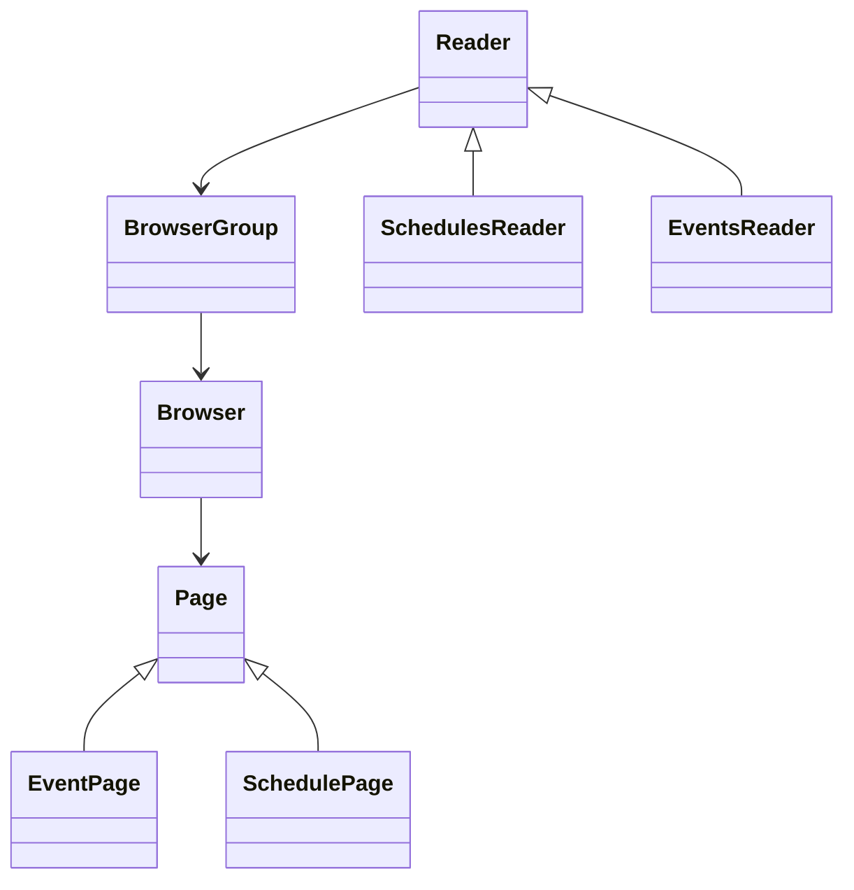

Requirements/tasks:
  - ~~Object and API containing info on past/current/upcoming races~~
  - ~~Object and API containing info on current races~~
  - ~~If browser/page encounters error, restart a copy~~

Folder/file structure:
```
src
|- scraper
|  |- main.rs
|  |- browser_group.rs
|  |- browser.rs
|  |- pages
|  |  |- page.rs
|  |  |- event_page.rs
|  |  +- schedule_page.rs
|  |- hosts
|  |  |- <bookie_name>
|  |  |  |- <bookie_name>_page.rs
|  |  |  |- <bookie_name>_event_page.rs
|  |  |  +- <bookie_name>_schedule_page.rs
|  |- reader.rs
|  |- readers
|     |- schedule
|     |  |- schedules_reader_config.rs
|     |  |- schedules_reader.rs
|     |  +- schedules_reader_output.rs
|     +- events
|        |- events_reader_config.rs
|        |- events_reader.rs
|        +- events_reader_output.rs
|- server
   |- main.rs
   |- routes
      |- scheduled_events_route.rs
      |- event_results_route.rs
      +- plans_route.rs
```

Model:

